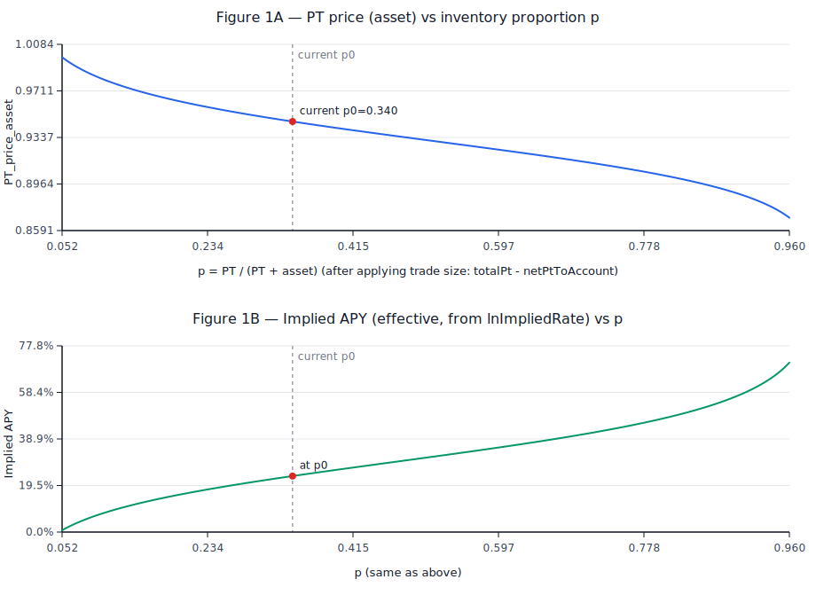
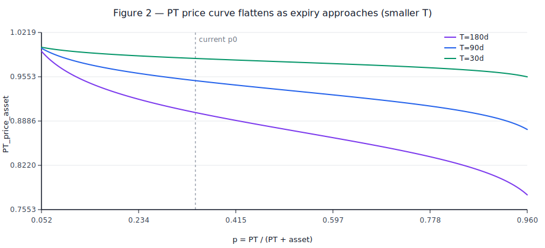
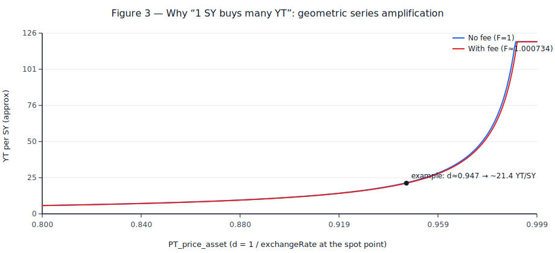

# Pendle Market（PT/SY AMM）定价机制与公式推导（从零到可复现，含曲线图）

> 读者定位：第一次系统性读 Pendle Market 定价代码的人  
> 目标：把 **“Market 在定价什么、用什么状态量、公式怎么来、手续费怎么加、Buy YT 为什么会变成 21x”** 一次讲清楚  
> 示例 market：`0xbE570Be4238BD9019aA8D575204f1DAA27Ee0a15`（asdPENDLE / sdPENDLE，2026-03-26 到期）  
> 图像生成脚本：`reports/tools/generate_pendle_pricing_figures.py`
>
> 生成图像（可选）：`python reports/tools/generate_pendle_pricing_figures.py`

---

## 0. 先把「名词」和「单位」钉死（后面才不会看懵）

### 0.1 三个 Token：SY / PT / YT

- **SY（Standardized Yield）**：统一入口的“生息资产份额”，它内部对应一种 `asset`（本例是 `sdPENDLE`）。
- **PT（Principal Token）**：像“零息债券本金票据”——到期时 **1 PT 可以兑回 1 单位 asset**（asset 口径）。
- **YT（Yield Token）**：到期前的“收益权”——只代表收益部分。

一个非常重要的直觉（忽略手续费与极小误差）：

- 以 asset 计价时，**`PT_price_asset + YT_price_asset ≈ 1`**。
  - PT 越接近 1，YT 就越薄（很便宜，像一片很薄的收益切片）。

### 0.2 asset 与 pyIndex：Market 内部其实都在算 asset

Pendle 为了让不同生息资产可统一定价，会把 SY 换算成 asset：

- `asset = sy * pyIndex`
- `sy = asset / pyIndex`

对应代码：
- `pyIndex` 与转换：`pendle-core-v2-public/contracts/core/StandardizedYield/PYIndex.sol:19`，`pendle-core-v2-public/contracts/core/StandardizedYield/SYUtils.sol:7`

### 0.3 一个关键点：PT/YT 的“数量单位”本身也是 asset 口径

你在 UI 里看到的 PT/YT 数量，不是“价值”，而是“以 asset 口径计的数量”：

- YT 合约 `mintPY`：每 **1 asset 的 SY** 会铸造 **1 PT + 1 YT**（数量相等，都是 asset 口径数量）
- 代码上等价于：`amountPY = syToAsset(index, amountSy)`

对应代码：
- `mintPY` 注释与行为：`pendle-core-v2-public/contracts/core/YieldContracts/PendleYieldToken.sol:86`
- `_calcPYToMint`：`pendle-core-v2-public/contracts/core/YieldContracts/PendleYieldToken.sol:348`

---

## 1. Market 到底在定价什么？——它定价的是「PT 相对 asset 的折价/利率」

Market 是一个 **PT ↔ SY 的 AMM**（池子里只有 `totalPt` 与 `totalSy`），但数学上先把 `totalSy` 换算成 `totalAsset`：

- `totalAsset = syToAsset(totalSy)`

对应代码：
- `totalAsset` 的预计算：`pendle-core-v2-public/contracts/core/Market/MarketMathCore.sol:205`

然后 Market 定义了一个中间量：

- `exchangeRate E = (PT per asset)`  
  - 注意：它不是“PT 的价格”，而是“每 1 单位 asset 能换多少 PT 的倒数关系”
  - **PT 价格（以 asset 计）**：`PT_price_asset = 1 / E`

如果你把 PT 类比为“到期兑 1 asset 的零息债券”，那么：

- `PT_price_asset` 就是折现因子（discount factor）
- `E = 1 / PT_price_asset`

---

## 2. 核心曲线：logit 库存比例 → exchangeRate

Market 的核心定价在 `MarketMathCore._getExchangeRate`：

- 库存比例（用 0~1 表示，合约里是 1e18 fixed-point）：

  `p = (totalPt - netPtToAccount) / (totalPt + totalAsset)`

- logit 变换：

  `logit(p) = ln(p/(1-p))`

- 价格曲线：

  `E(p) = logit(p)/rateScalar + rateAnchor`

对应代码：
- `p` 与 `logit`：`pendle-core-v2-public/contracts/core/Market/MarketMathCore.sol:326`，`pendle-core-v2-public/contracts/core/Market/MarketMathCore.sol:348`
- `E = logit/scale + anchor`：`pendle-core-v2-public/contracts/core/Market/MarketMathCore.sol:343`

### 2.1 这条曲线解决了什么问题？

直觉解释：
- 当池子里 **PT 很多、asset 很少**（`p` 大），PT 应该更便宜 ⇒ `PT_price_asset` 下降 ⇒ `E` 上升。
- 当池子里 **PT 很少、asset 很多**（`p` 小），PT 更贵 ⇒ `PT_price_asset` 上升 ⇒ `E` 下降（但合约要求 `E >= 1`）。

logit 的好处：
- 当 `p → 1` 时，`logit(p) → +∞`（价格会“推开”边界，避免把 PT 买光）
- 当 `p → 0` 时，`logit(p) → -∞`
- 合约还额外限制 `p <= 0.96` 防止极端区间数值爆炸（`MAX_MARKET_PROPORTION`）

对应代码：
- `MAX_MARKET_PROPORTION` 与检查：`pendle-core-v2-public/contracts/core/Market/MarketMathCore.sol:46`，`pendle-core-v2-public/contracts/core/Market/MarketMathCore.sol:337`

---

## 3. rateScalar / rateAnchor：把「库存曲线」锚定到「隐含利率」

### 3.1 Market 存的不是价格，而是「隐含利率 lastLnImpliedRate」

Market 存一个状态 `lastLnImpliedRate`，你可以把它理解成：

- `r = lastLnImpliedRate`：**年化、连续复利**的“隐含利率”

它和 `E` 的关系（到期剩余 `T` 秒，1 年为 `1y` 秒）：

- `E0 = exp(r * T / 1y)`

对应代码：
- `E = exp(rT)`：`pendle-core-v2-public/contracts/core/Market/MarketMathCore.sol:314`

### 3.2 rateScalar：用时间缩放，让“不同到期”有类似的利率曲线强度

合约定义：

- `rateScalar = scalarRoot * 1y / T`

对应代码：
- `rateScalar`：`pendle-core-v2-public/contracts/core/Market/MarketMathCore.sol:356`

一个很关键但容易误读的点：
- `T` 越小（越接近到期），`rateScalar` 越大 ⇒ **`logit(p)/rateScalar` 的贡献越小**  
  这会让 **`E(p)`（也就是 PT 折价）随库存变化更“平”**，从而配合 `E0` 自身随到期趋近 1，使 PT 价格整体自然收敛到 1 附近。

与此同时，由于隐含利率是：

- `r = ln(E) * 1y / T`（见 `_getLnImpliedRate`）

当 `T` 变小，同样的 `E` 变化会被 `1/T` 放大；所以 Pendle 用 `rateScalar ∝ 1/T` 去抵消一部分“年化放大效应”，让曲线更稳定。

对应代码：
- 从 `E` 反推 `r`：`pendle-core-v2-public/contracts/core/Market/MarketMathCore.sol:298`

### 3.3 rateAnchor：确保曲线在当前库存点“连续”

Market 会先在 **当前库存点**（`netPtToAccount=0`）算：

- `p0 = totalPt / (totalPt + totalAsset)`
- `E0 = exp(lastLnImpliedRate * T / 1y)`

然后设：

- `rateAnchor = E0 - logit(p0)/rateScalar`

这样就保证 `E(p0) = E0`，也就是“曲线经过当前现货点”。

对应代码：
- `_getRateAnchor`：`pendle-core-v2-public/contracts/core/Market/MarketMathCore.sol:276`

---

## 4. 交易如何按曲线结算？（calcTrade：把 PT 换成 asset，再加 fee，再换回 SY）

这部分对应 `MarketMathCore.calcTrade`：

1. 先按交易方向与规模得到 `preFeeExchangeRate`
2. 把 PT 数量换成 asset 数量（pre-fee）
3. 应用 feeFactor `F`
4. fee 按比例拆分：一部分给 treasury（reserve），其余留在池子（LP）
5. 把 asset 结果换回 SY（用 pyIndex）

对应代码入口：
- `calcTrade`：`pendle-core-v2-public/contracts/core/Market/MarketMathCore.sol:226`

### 4.1 方向约定：netPtToAccount 的正负

- `netPtToAccount > 0`：用户 **买 PT**（从池子拿走 PT）⇒ 用户要付出 SY/asset
- `netPtToAccount < 0`：用户 **卖 PT**（把 PT 给池子）⇒ 用户收到 SY/asset

这个符号习惯会导致很多人第一次读 `preFeeAssetToAccount` 时困惑：

- `preFeeAssetToAccount = - netPtToAccount / preFeeExchangeRate`
  - 买 PT：`netPtToAccount > 0` ⇒ `preFeeAssetToAccount < 0`（用户付 asset）
  - 卖 PT：`netPtToAccount < 0` ⇒ `preFeeAssetToAccount > 0`（用户收 asset）

对应代码：
- `preFeeAssetToAccount`：`pendle-core-v2-public/contracts/core/Market/MarketMathCore.sol:234`

### 4.2 手续费：feeFactor F = exp(lnFeeRateRoot * T/1y)

Market 不直接存一个“百分比 fee”，而是存 `lnFeeRateRoot`，按剩余期限转换成乘数：

- `F = exp(lnFeeRateRoot * T/1y)`

对应代码：
- `feeRate = exp(lnFeeRateRoot*T/1y)`：`pendle-core-v2-public/contracts/core/Market/MarketMathCore.sol:223`

直觉上你可以把它理解成：

- 买 PT：`asset_in(post) ≈ asset_in(pre) * F`
- 卖 PT：`asset_out(post) ≈ asset_out(pre) / F`

合约实现是一个“把多付/少收的部分记为 fee”的等价写法（见 `if (netPtToAccount > 0) ... else ...` 分支）。

### 4.3 reserveFeePercent：手续费拆分

fee 里有一部分会直接转给 `treasury`（池子外），比例是：

- `netAssetToReserve = fee * reserveFeePercent / 100`

对应代码：
- `reserveFeePercent`：`pendle-core-v2-public/contracts/core/Market/MarketMathCore.sol:246`

### 4.4 router 会影响 fee（重要！）

Market 读取状态时会从 factory 取一个「按 router 维度」的 fee override：

- `overriddenFee != 0` 则覆盖 `lnFeeRateRoot`

对应代码：
- `readState(router)`：`pendle-core-v2-public/contracts/core/Market/PendleMarketV6.sol:307`
- `getMarketConfig`：`pendle-core-v2-public/contracts/core/Market/PendleMarketFactoryV6Upg.sol:108`

---

## 5. “Buy YT 为什么会 21x？”——因为它不是 1 次 mint，而是「卖 PT 回收本金」的循环/闪电合成

如果你只做一次 tokenization：

- 你给 YT 合约 1 SY
- 它最多 mint 出 `pyIndex` 数量的 `PT + YT`

对应代码：
- `mintPY`：`pendle-core-v2-public/contracts/core/YieldContracts/PendleYieldToken.sol:90`

但 UI 的 **Buy YT** 想要“纯 YT”，它会：

1. 用一部分 SY 去 mint `PT+YT`
2. 把 mint 出来的 PT 卖给 Market 换回 SY
3. 用换回的 SY 继续 mint
4. 直到 SY 用尽

链上实现形式是“flashswap + callback”：
- Router 通过 `market.swapExactPtForSy(receiver=YT, ...)` 先把 PT 卖掉拿到 SY（SY 直接送到 YT 合约）
- 然后在 callback 里，YT 用收到的 SY `mintPY`，铸造的 PT 回给 market 抵债，YT 给用户
  - 这里的关键是 **flashswap**：market 会先把 SY 付出去，再在 callback 里要求“补交”应付的 PT；而 PT 恰好可以用这笔 SY + 用户自己的 SY 在 YT 合约里现场 mint 出来

对应代码：
- Router 入口：`pendle-core-v2-public/contracts/router/base/ActionBase.sol:278`
- callback：`pendle-core-v2-public/contracts/router/ActionCallbackV3.sol:88`
- 链上求解“该借多少 PT”：`pendle-core-v2-public/contracts/router/math/MarketApproxLibV2.sol:19`

### 5.1 小额近似（忽略 price impact）下的闭式解：几何级数

把过程放到 asset 口径直觉化：
- 每 “1 asset” 的 SY 进 YT 合约，会 mint “1 PT + 1 YT”
- 卖出 1 PT，预期能换回大约 `PT_price_asset / F` 的 asset（卖 PT 会被 fee 除掉）

令：
- `d = PT_price_asset = 1/E0`
- `k = d / F`（卖 1 PT 回收的 asset 比例）

则用 1 asset 作为起始本金，可累计 mint 的 YT 数量（asset 口径）约为：

- `1 + k + k^2 + ... = 1/(1-k)`

换回到 “每 1 SY”：
- `1 SY = pyIndex asset`
- `YT_per_SY ≈ pyIndex / (1 - d/F)`

这就是为什么当 `d` 很接近 1（PT 很值钱、YT 很薄）时，`1/(1-k)` 会很大，看起来像“杠杆”。

> 也因此手续费会被放大：手续费主要发生在“卖 PT”这条大额腿上，而 YT 本身价值很薄，折算成 YT 口径会显得很痛。

---

## 6. 用本例 market 的真实数量级走一遍（帮你把公式落地）

来自原始研究笔记（同目录报告）里的一组快照参数：
- `pyIndex ≈ 1.15909 asset/SY`
- `E0 ≈ 1.05651` ⇒ `d = 1/E0 ≈ 0.94651`
- `F ≈ 1.000734`

代入上面的闭式解：

- `k = d/F ≈ 0.9458`
- `YT_per_SY ≈ 1.15909 / (1 - 0.9458) ≈ 21.4`

这就是 UI 上 “1 asdPENDLE（≈1 SY）能买到 ~21 YT” 的量级来源。

---

## 7. 曲线图（建议先看图，再回头看代码）

### Figure 1：库存比例 p 如何影响 PT 价格与隐含利率（本例 market 参数）

读图要点：
- 上图 y 轴是 `PT_price_asset = 1/E(p)`；它变化不大，但足够决定 YT 的薄厚（`1-d`）。
- 下图 y 轴是隐含年化利率（连续复利转有效年化）：`APY = exp(lastLnImpliedRate(p)) - 1`。

### Figure 2：越接近到期（T 变小），PT 价格曲线会更贴近 1、也更“平”

读图要点：
- 这是 `rateScalar = scalarRoot*1y/T` 与 `E0 = exp(rT/1y)` 共同作用的结果：剩余时间越短，折现越小，PT 价格自然趋近 1。

### Figure 3：为什么 “1 SY → 很多 YT”（几何级数的爆炸感）

读图要点：
- 横轴 PT 价格越接近 1（YT 越薄），右侧 `1/(1-k)` 越大 ⇒ “1 SY 能换到的 YT 数量”会迅速变大。
- 加上手续费 `F>1` 会把曲线往下压（因为每轮卖 PT 回收的本金更少）。

---

## 8. 你读代码时最容易踩的坑（建议对照检查）

1. **别把 `exchangeRate E` 当成 PT 价格**：`PT_price_asset = 1/E`（`MarketMathCore.sol:326`）。
2. **PT/YT 数量单位不是价值单位**：数量是 asset 口径（`PendleYieldToken.sol:348`）。
3. **Market 里储备是 PT + SY，但曲线在 PT + asset 上计算**（`MarketMathCore.sol:205`）。
4. **fee 是按“期限缩放乘数”实现的**，不是一个固定的 bps（`MarketMathCore.sol:223`）。
5. **router 不同，fee 可能不同**（`PendleMarketV6.sol:307`）。

---

## 附录 A：核心公式 ⇄ 代码位置速查

- `totalAsset = syToAsset(totalSy)`：`pendle-core-v2-public/contracts/core/Market/MarketMathCore.sol:205`
- `rateScalar = scalarRoot*1y/T`：`pendle-core-v2-public/contracts/core/Market/MarketMathCore.sol:356`
- `rateAnchor = E0 - logit(p0)/rateScalar`：`pendle-core-v2-public/contracts/core/Market/MarketMathCore.sol:276`
- `E(p) = logit(p)/rateScalar + rateAnchor`：`pendle-core-v2-public/contracts/core/Market/MarketMathCore.sol:343`
- `preFeeAssetToAccount = -(netPtToAccount / E)`：`pendle-core-v2-public/contracts/core/Market/MarketMathCore.sol:234`
- `F = exp(lnFeeRateRoot*T/1y)`：`pendle-core-v2-public/contracts/core/Market/MarketMathCore.sol:223`
- Buy YT（flashswap 合成）：`pendle-core-v2-public/contracts/router/base/ActionBase.sol:278` + `pendle-core-v2-public/contracts/router/ActionCallbackV3.sol:88`
- 求解借多少 PT（approx）：`pendle-core-v2-public/contracts/router/math/MarketApproxLibV2.sol:19`
