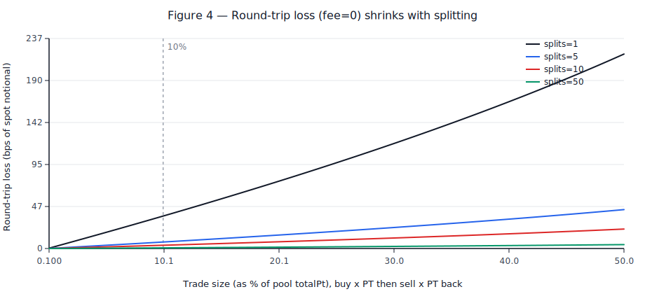
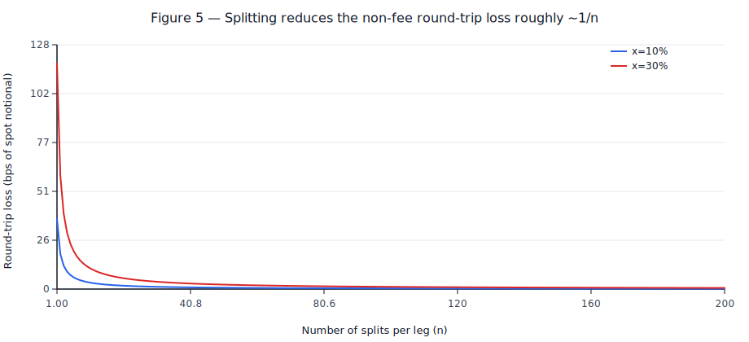
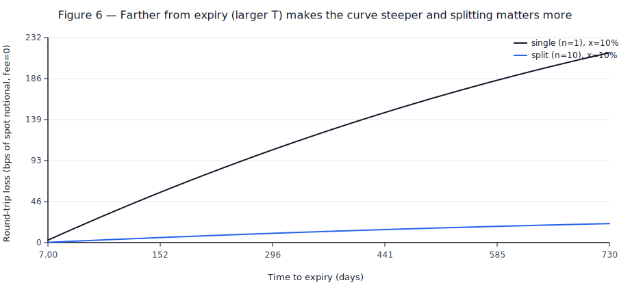

# Pendle Market：拆单 vs 不拆单的“额外损失”（非 fee）对比报告（含曲线）

> 目标：把你问的“为什么不拆单会多亏一点、谁赚了、什么时候很大/可忽略”做成一份可复现的定量报告  
> 关联主报告：`reports/pendle-market-pricing-mechanism-explained.md`（解释定价曲线/费率/Buy YT）  
> 图像生成脚本：`reports/tools/generate_pendle_pricing_figures.py`（无第三方依赖，输出 SVG 到 `reports/assets/`）

---

## 0. 这份报告在比较什么？

这里的“拆单/不拆单”特指：**同样买入（或卖出）同样数量的 PT**，你是一次做完，还是拆成多次小单顺序执行。

为避免把手续费、rounding、其他人交易等因素混在一起，这份报告的曲线默认采用一个“干净实验”：

- **fee=0**（`feeFactor=1`），只看“公式/结算方式”带来的额外损失
- 忽略 `SY <-> asset` 的取整（链上 `assetToSyUp/assetToSy` 的 rounding 会引入额外 tiny loss）
- 视为同一时刻执行（`T`、`pyIndex` 不变；没有第三方插队）

现实世界里，你的总损耗 = **fee** + **这里的拆单额外损失** + **rounding** + **MEV/别人交易导致的价格变化**。

---

## 1. 为什么“拆单”会更省？——关键在 Pendle 的结算用的是“终点价”

在 Pendle 的 `MarketMathCore.calcTrade()` 中（忽略 fee 与 rounding），一笔“买 x PT（exact-out）”的核心结算是：

- 先用库存坐标算终点的 `exchangeRate`：`E_trade = E(p_trade)`
- 然后按 **终点的 `E_trade`** 直接结算整笔的 asset：`asset_paid ≈ x / E_trade`

对应代码：
- `p_trade = (totalPt - x)/(totalPt + totalAsset)`：`pendle-core-v2-public/contracts/core/Market/MarketMathCore.sol:311`
- `assetToAccount = -(x / E_trade)`：`pendle-core-v2-public/contracts/core/Market/MarketMathCore.sol:234`

直觉上，这等价于把一条随库存变化的价格曲线，做了一次“右端点 Riemann sum”（整笔都用终点的边际价当均价）：

- 买 PT 时：你沿着曲线把 PT 越买越贵（`E` 越买越低，`PT_price=1/E` 越买越高）  
  用终点价结算会 **偏贵** ⇒ 你多付一点点
- 卖 PT 时同理：用终点价结算会 **偏便宜** ⇒ 你少收一点点

把大单拆成很多小单，相当于用更多个“端点”去近似真实的“连续成交路径”，所以总成本更接近“连续极限”，额外损耗会明显下降（后面 Figure 5 会看到大致 `~1/n`）。

---

## 2. 我们怎么定义“拆单额外损失”？

### 2.1 单边（只买或只卖）额外成本

以“买 x PT（exact-out）”为例：

- `Cost(1)`：不拆单，一笔买完的 asset 支出
- `Cost(n)`：拆成 n 笔、每笔买 `x/n` 的总 asset 支出
- 定义“拆单带来的改善”：`ExtraCost(n) = Cost(1) - Cost(n)`（越大说明“不拆单”越亏）

### 2.2 往返（买入后立刻卖回）净损失

这是你前面最关心的“我买了又卖掉，除了 fee 还有啥”：

- `Loss_roundtrip(n)`：先买 x PT（拆 n 笔），再立刻卖回 x PT（也拆 n 笔）的净亏损

我们把它换算成 bps 更直观：

- `notional ≈ x * PT_price_spot`（用 spot 的 PT 价格把 x PT 换成 asset 口径名义金额）
- 报告里所有 y 轴用：`loss_bps = loss_asset / notional * 1e4`

---

## 3. 曲线图（基于示例 market 的快照参数；fee=0）

> 示例参数与主报告一致（`totalPt/totalSy/pyIndex/scalarRoot/lastLnImpliedRate/T`），用于“量级感”而非承诺所有市场都一样。

### Figure 4：往返损失 vs 交易规模（拆单数越多越接近 0）

读图要点：
- 损失对交易规模非常敏感：从 1% 池子规模到 10% 池子规模，loss_bps 会放大一个数量级左右。
- 拆单的收益很直接：同样 x=10%，`splits=10` 的损失约是 `splits=1` 的 1/10。

### Figure 5：往返损失 vs 拆单数 n（大致 ~1/n，边际收益递减）

读图要点：
- 从 1 拆到 5 拆、10 拆，改善很明显；从 50 拆到 200 拆，改善开始变小（通常不值额外 gas/复杂度）。
- 交易越大（例如 x=30%），同样的 n 能减少的绝对 bps 更多，但“~1/n”趋势仍在。

### Figure 6：离到期越远（T 越大），曲线越“陡”，拆单影响越大

读图要点：
- 这是 `rateScalar = scalarRoot * 1y / T` 的直接后果：`T` 越大，`rateScalar` 越小，`E(p)` 对库存变化更敏感，端点定价的误差也更大。
- 越接近到期，拆不拆差别会快速变小（但 fee/rounding 仍然存在）。

---

## 4. 什么时候这个影响“非常大”？什么时候可以忽略？

把 Figure 4/6 的现象总结成可操作的判断：

### 4.1 影响会非常大（建议认真模拟、考虑拆单/拆路径）

- **你的 trade size 是池子的一个“大比例”**（经验：`x` 达到 `totalPt` 的 10% 以上，开始容易出现几十 bps 量级的往返损失）
- **离到期很远（T 大）**：同样的交易比例下，远期市场的端点误差更大（Figure 6）
- **库存比例 p 接近边界（PT 或 asset 极端稀缺）**：logit 在边界附近斜率爆炸，任何端点近似都会更差
- **你在做 Buy YT / Sell YT 这类“合成路径”**：虽然表面上你只花了一点 SY，但内部可能会隐含一条很大的 PT 腿（相当于更大的有效 x），拆单误差会被放大

### 4.2 影响可以忽略（通常没必要拆）

- **你的 trade size 很小**（例如 `< 1%` 的池子规模），端点误差是二阶项，常常 < 1–5 bps；这时决定你盈亏的往往是 fee、gas、MEV、以及外部价格噪声
- **离到期很近（T 小）**：曲线更平，端点误差很小（Figure 6 的左侧）

一个简单的“工程化判断法”（做 bot 很好用）：

- 先用当前状态离线模拟 `splits=1` 和 `splits=10`（或 `20`）的成交差  
- 如果节省出来的 bps * notional **显著大于** 额外 gas + MEV 风险溢价，才值得拆

---

## 5. 如何复现/改参数？

运行：

- `python reports/tools/generate_pendle_pricing_figures.py`

会生成/覆盖以下图像（含本报告用到的 3 张新图）：
- `reports/assets/pendle-fig4-roundtrip-loss-vs-trade-size-splits.svg`
- `reports/assets/pendle-fig5-roundtrip-loss-vs-splits.svg`
- `reports/assets/pendle-fig6-roundtrip-loss-vs-time-to-expiry.svg`

脚本里用的是 float 近似、并刻意关闭了 fee 与 rounding；如果你要做“精确链上复现”，建议在你自己的仿真器里把：
- `feeFactor`（`lnFeeRateRoot` + router override）
- `assetToSyUp/assetToSy` 的取整方向
- `pyIndexCurrent()` 的读法与缓存
都按合约实现补齐（参见主报告的“合约实现视角”章节）。

